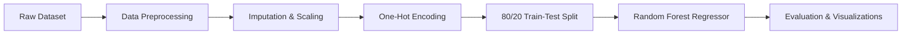

# Real-Estate-Assignment 🏡 ML Housing Price Prediction

[](https://www.python.org/)
[](https://scikit-learn.org/)
[](https://pandas.pydata.org/)
[](LICENSE)

> **School / Coursework ML Project**  
> An end-to-end Machine Learning pipeline designed to clean, preprocess, and model US real estate data using **Random Forest Regression** to predict property valuations.

---

## 📌 Project Overview

Accurate property valuation is essential in real estate analytics. This project explores real estate pricing trends using a US Realtor dataset. The pipeline covers raw data extraction, feature engineering, missing value imputation, one-hot encoding, model training, and performance evaluation using key regression metrics.

---

## 📂 Repository Structure

```text
Real-Estate-Assignment/
├── README.md                      # Project overview, methodology & usage instructions
├── requirements.txt               # Required Python packages
├── .gitignore                     # Git ignore file for temporary files & outputs
├── data/                          # Real estate dataset folder
│   └── 2 realtor-data.csv         # Raw US realtor dataset
├── notebooks/                     # Interactive exploratory analysis & prototyping
│   └── ML_Final_Model.ipynb       # Jupyter notebook with complete execution flow
├── src/                           # Production-ready Python source code
│   ├── data_preprocessor.py       # Data cleaning, scaling, and feature encoding pipeline
│   └── ml_model.py                # Random Forest model training & evaluation script
├── outputs/                       # Generated plots and visual evaluation outputs
└── docs/                          # Project documentation
    └── ML_project_report.pdf      # Detailed project write-up & findings report
```

---

## 📊 Dataset & Features

The raw dataset (`data/2 realtor-data.csv`) contains property listing information across US states:

| Feature | Type | Description |
| :--- | :--- | :--- |
| `price` | **Target** | Listing price of the property in USD ($) |
| `bed` | Numerical | Number of bedrooms |
| `bath` | Numerical | Number of bathrooms |
| `acre_lot` | Numerical | Land lot size in acres |
| `house_size` | Numerical | Building living space area (sq ft) |
| `zip_code` | Categorical | Postal code location |
| `city` / `state` | Categorical | City and state locations |
| `full_address` / `street` | Text *(Dropped)* | Specific street addresses (excluded to prevent overfitting) |

---

## ⚙️ Machine Learning Pipeline



### 1. Data Cleaning & Preprocessing (`src/data_preprocessor.py`)
- **Irrelevant Column Removal**: Excludes non-predictive columns such as exact street addresses.
- **Numerical Processing**: Applies `SimpleImputer` (median strategy) to handle missing values and scales features using `StandardScaler`.
- **Categorical Processing**: Imputes missing values with a constant label and converts categorical fields (e.g. `zip_code`, `state`) using `OneHotEncoder`.

### 2. Model Training & Evaluation (`src/ml_model.py`)
- **Algorithm**: `RandomForestRegressor` ensemble with multi-core CPU optimization (`n_jobs=-1`).
- **Evaluation Metrics**:
  - **$R^2$ Score**: Measures variance explained by the model.
  - **RMSE (Root Mean Squared Error)**: Quantifies prediction deviation in dollars.

---

## 🚀 Getting Started

### 1. Clone the Repository
```bash
git clone https://github.com/YOUR-USERNAME/Real-Estate-Assignment.git
cd Real-Estate-Assignment
```

### 2. Install Dependencies
Ensure Python 3.8+ is installed, then install required dependencies:
```bash
pip install -r requirements.txt
```

### 3. Run Data Preprocessing
Preprocess raw data and save transformed feature arrays:
```bash
python src/data_preprocessor.py
```

### 4. Train the Model & Generate Visuals
Train the Random Forest Regressor and save evaluation graphs to `outputs/`:
```bash
python src/ml_model.py
```

### 5. Run the Jupyter Notebook
For interactive experimentation, launch Jupyter Notebook:
```bash
jupyter notebook notebooks/ML_Final_Model.ipynb
```

---

## 📑 Project Report & References

A comprehensive report detailing experimental design, feature importance analysis, and project conclusions can be found under the [`docs/`](docs/) directory:
- [📄 ML_project_report.pdf](docs/ML_project_report.pdf)

---

## 📄 License

This repository is created for academic and educational purposes under the [MIT License](LICENSE).
