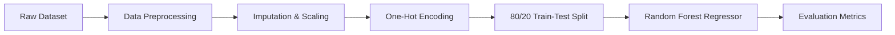

# Real-Estate-Assignment: US Housing Price Prediction

[](https://www.python.org/)
[](https://scikit-learn.org/)
[](https://pandas.pydata.org/)
[](LICENSE)

An end-to-end Machine Learning pipeline designed to clean, preprocess, and model US real estate data using Random Forest Regression to predict property valuations.

---

## Project Overview

Accurate property valuation is essential in real estate analytics. This project explores real estate pricing trends using a US Realtor dataset. The pipeline covers raw data extraction, feature engineering, missing value imputation, one-hot encoding, model training, and performance evaluation using key regression metrics.

---

## Repository Structure

```text
Real-Estate-Assignment/
├── README.md                      # Project overview, methodology, and usage instructions
├── requirements.txt               # Required Python dependencies
├── .gitignore                     # Git ignore file for temporary files and outputs
├── data/                          # Real estate dataset directory
│   └── 2 realtor-data.csv         # Raw US realtor dataset
├── notebooks/                     # Exploratory analysis and prototyping
│   └── ML_Final_Model.ipynb       # Jupyter notebook with execution flow
├── src/                           # Python source code
│   ├── data_preprocessor.py       # Data cleaning, scaling, and feature encoding pipeline
│   └── ml_model.py                # Random Forest model training and evaluation script
├── outputs/                       # Generated plots and evaluation graphics
└── docs/                          # Project documentation
    └── ML_project_report.pdf      # Coursework report and findings
```

---

## Dataset and Features

The raw dataset (`data/2 realtor-data.csv`) contains property listing information across US states:

| Feature | Type | Description |
| :--- | :--- | :--- |
| `price` | Target | Listing price of the property in USD ($) |
| `bed` | Numerical | Number of bedrooms |
| `bath` | Numerical | Number of bathrooms |
| `acre_lot` | Numerical | Land lot size in acres |
| `house_size` | Numerical | Living area space in square feet |
| `zip_code` | Categorical | Postal code location |
| `city` / `state` | Categorical | City and state location attributes |
| `full_address` / `street` | Text (Dropped) | Specific street addresses (excluded to avoid overfitting) |

---

## Machine Learning Pipeline



### 1. Data Cleaning and Preprocessing (`src/data_preprocessor.py`)
- **Irrelevant Column Removal**: Excludes non-predictive text attributes such as specific street addresses.
- **Numerical Processing**: Applies `SimpleImputer` (median strategy) to handle missing values and scales numerical features using `StandardScaler`.
- **Categorical Processing**: Imputes missing values with a constant placeholder and encodes categorical fields (e.g., `zip_code`, `state`) using `OneHotEncoder`.

### 2. Model Training and Evaluation (`src/ml_model.py`)
- **Algorithm**: `RandomForestRegressor` ensemble model with multi-core parallel processing (`n_jobs=-1`).
- **Evaluation Metrics**:
  - **R-squared ($R^2$) Score**: Quantifies the variance explained by the model.
  - **Root Mean Squared Error (RMSE)**: Measures standard deviation of residuals in USD ($).

---

## Getting Started

### 1. Environment Setup
Ensure Python 3.8+ is installed, then install the required dependencies:
```bash
pip install -r requirements.txt
```

### 2. Running Data Preprocessing
To preprocess the raw dataset and export transformed feature arrays:
```bash
python src/data_preprocessor.py
```

### 3. Training and Model Evaluation
To train the Random Forest Regressor and output evaluation metrics:
```bash
python src/ml_model.py
```

### 4. Running the Jupyter Notebook
For interactive analysis and experimentation:
```bash
jupyter notebook notebooks/ML_Final_Model.ipynb
```

---

## Documentation and License

- Detailed findings and project methodology are available in [docs/ML_project_report.pdf](docs/ML_project_report.pdf).
- Distributed under the [MIT License](LICENSE).
